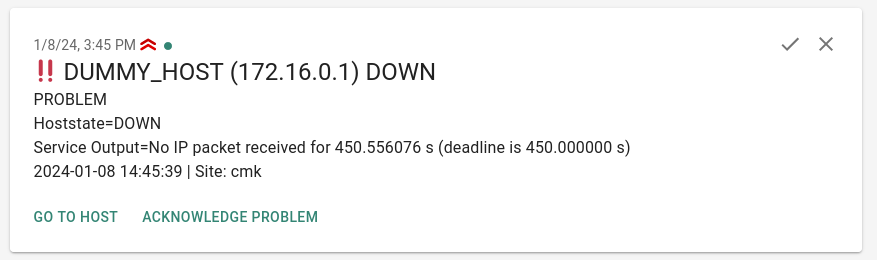

# CheckMK ntfy notification

This [CheckMK](https://checkmk.com/) notification script sends notifications to [ntfy.sh](https://ntfy.sh/) or a self hosted ntfy instance.
It adds a link to the CheckMK host/service and let's you acknowledge the host/service problem directly from the notification.





## Installation

Requires CheckMK >= 2.0.0p1

Change to your CheckMK site user

```bash
su - mysite
```

Download the package from the release page of this repository

```bash
# Automatic get and download the latest release
curl -s https://api.github.com/repos/Madic-/checkmk-ntfy/releases/latest | grep "browser_download_url" | cut -d : -f 2,3 | tr -d \" | wget -qi -
```

Install extension

```bash
mkp add ntfy-1.1.0.mkp
```

Enable extension

```bash
mkp enable ntfy
```

### Acknowledging the host/service problem

To be able to acknowledge the host/service problem directly from the notification, you need to add [HTTP CORS](https://developer.mozilla.org/en-US/docs/Web/HTTP/CORS) configuration to your checkmk site.

Change to your CheckMK site user

```bash
su - mysite
```

Open apache security.conf

```bash
nano $HOME/etc/apache/conf.d/security.conf
```

Add the value **OPTIONS** to REQUEST_METHOD

```bash
# From
<IfModule mod_rewrite.c>
  RewriteEngine on
  RewriteCond %{REQUEST_METHOD} !^(HEAD|GET|POST|DELETE|PUT)
  RewriteRule .* - [R=405,L]
</IfModule>
# To
<IfModule mod_rewrite.c>
  RewriteEngine on
  RewriteCond %{REQUEST_METHOD} !^(HEAD|GET|POST|DELETE|PUT|OPTIONS)
  RewriteRule .* - [R=405,L]
</IfModule>
```

Open apache site.conf

```bash
nano $HOME/etc/apache/conf.d/site.conf
```

Add cors policies within your site configuration

```bash
# General configuration for this site
#
<Location "/cmk">
  # put your extra site configs here
  Header set Access-Control-Allow-Origin "*"
  Header set Access-Control-Allow-Methods "OPTIONS, GET, POST, PUT"
  Header set Access-Control-Allow-Headers "Origin, Content-Type, Cache-Control, Cookies, Authorization"
  Header set Access-Control-Allow-Credentials "true"
  Header set Access-Control-Max-Age "1728000"
</Location>
```

Restart apache

```bash
omd restart apache2
```

Instead of using the wildcard "*" you can also specify a domain, like the one from your ntfy instance.

## CheckMK Configuration

The name for the notification method is "Push Notifications (using ntfy.sh)".

Every script parameter is configurable via the notification configuration in CheckMK.


It does not support notification bulking.

I recommend to configure only one user for the contact selection. Else it generates a notification per contact. So if a host / service has two contacts associated, it will generate two notifications.


Example condition configuration:


